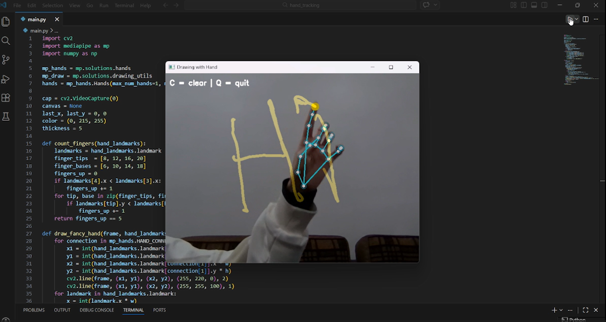

# Computer Vision Hand Tracking

A real-time hand tracking project built using Python, OpenCV, and MediaPipe.

## Features

- Real-time hand detection
- Hand landmark tracking
- Webcam integration
- Computer vision processing
- Hand-controlled drawing on screen
- Clear canvas using keyboard shortcut

## Technologies Used

- Python
- OpenCV
- MediaPipe
- NumPy

## How to Run

1. Install the required libraries:

```bash
pip install opencv-python mediapipe numpy
```

2. Run the project:

```bash
python main.py
```

## Controls

- Press `C` to clear the canvas
- Press `Q` to quit the application
- Raise all five fingers to pause drawing

## Demo



## Project Goal

This project was created to explore computer vision, real-time hand tracking, and gesture-based interaction using Python.
